# User Journey Flows
## Hospitality Management Platform

This document maps every primary user journey across the three actor types —
**Guest**, **Hotel Owner (org_admin)**, and **Platform Admin** — with Mermaid
flow diagrams for each.

> Diagrams use [Mermaid](https://mermaid.js.org/) syntax and render natively in
> GitHub, GitLab, Notion, and most modern documentation tools.

---

## Table of Contents

1. [Guest Journeys](#1-guest-journeys)
   - 1.1 Account Registration
   - 1.2 Hotel Discovery & Search
   - 1.3 Hotel Booking (Happy Path)
   - 1.4 Physical Arrival & Check-In
   - 1.5 Check-Out
   - 1.6 Leaving a Review
   - 1.7 Managing Bookings (View / Cancel)
   - 1.8 Forgot Password
2. [Hotel Owner Journeys](#2-hotel-owner-journeys)
   - 2.1 Onboarding (First-Time Setup)
   - 2.2 Managing Daily Reservations
   - 2.3 Front-Desk Check-In
   - 2.4 Front-Desk Check-Out
   - 2.5 Updating Hotel & Room Information
3. [Platform Admin Journeys](#3-platform-admin-journeys)
   - 3.1 Provisioning a New Hotel Owner (Tenant)
   - 3.2 Reviewing & Managing Users
4. [System Event Flows](#4-system-event-flows)
   - 4.1 Booking Confirmation Email Flow
   - 4.2 Password Reset Email Flow
   - 4.3 Reservation Status Lifecycle

---

## 1. Guest Journeys

### 1.1 Account Registration

**Entry point:** Any page with a "Sign Up" / "Register" CTA, or the `/register` page directly.

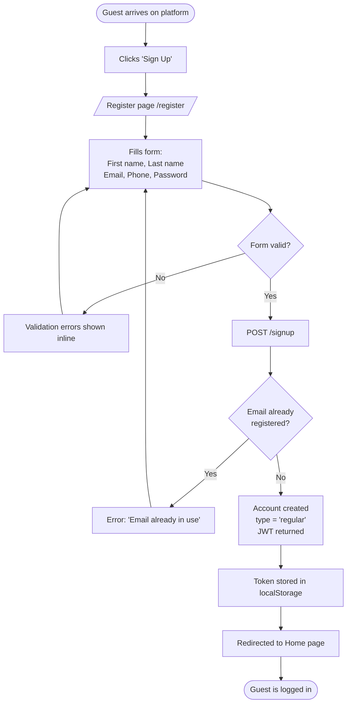

---

### 1.2 Hotel Discovery & Search

**Entry point:** Home page hero search bar, or the Hotels listing page.

```mermaid
flowchart TD
    A([Guest arrives on Home page]) --> B{How does guest\nwant to find a hotel?}

    B -- Browse all --> C[Clicks 'Browse Hotels'\n/hotels]
    B -- Search by city/state --> D[Types city or state\nin hero search bar]
    B -- Browse featured --> E[Clicks Top Deal card\nor Top Destination card]

    C --> F[/hotels — full listing\nwith filters panel]
    D --> G[/search?city=Lagos&...\nSearch results page]
    E --> H{Top Deal or\nDestination?}
    H -- Top Deal --> I[/topdeals results]
    H -- Destination --> J[/topdestinations → city filter]

    F --> K[Guest applies filters:\nPrice range, Amenities\nHotel type, Date range]
    G --> K
    I --> K
    J --> K

    K --> L[Filtered hotel cards\nshown with name, city,\nprice, rating, deal badge]
    L --> M[Guest clicks hotel card]
    M --> N[/hotels/:id — Hotel Detail Page]
    N --> O[Views photos, description,\nfacilities, reviews, rooms]
    O --> P{Interested in\na room?}
    P -- No --> L
    P -- Yes --> Q([Proceeds to Booking Journey])
```

---

### 1.3 Hotel Booking (Happy Path)

**Entry point:** Hotel Detail page, after selecting a room.

```mermaid
flowchart TD
    A([Guest on Hotel Detail page]) --> B[Clicks 'Book Now' on a room]
    B --> C{Is guest\nlogged in?}
    C -- No --> D[Redirected to /login\nwith return URL]
    D --> E[Guest logs in]
    E --> B
    C -- Yes --> F[/book/:roomId — Booking page]
    F --> G[Selects:\nCheck-in date\nCheck-out date\nNumber of guests]
    G --> H{Dates valid &\nroom available?}
    H -- No --> I[Error: 'Room not available\nfor selected dates']
    I --> G
    H -- Yes --> J[Reviews booking summary:\nHotel, Room, Dates, Price total]
    J --> K[Enters payment details\nvia Stripe widget]
    K --> L{Payment\nauthorised?}
    L -- No --> M[Payment error shown\nGuest can retry or use\ndifferent card]
    M --> K
    L -- Yes --> N[POST /reservation\nstatus = 'pending']
    N --> O[Reservation created\nPayment captured\nStatus → 'confirmed']
    O --> P[Booking confirmation email\nqueued via QStash]
    P --> Q[Email delivered to guest\nwith booking details + QR code]
    O --> R[Redirected to\n/booking/:id/confirmation]
    R --> S[Confirmation page shows:\nHotel, Room, Dates\nGuest count, QR pass]
    S --> T([Guest saves / prints QR pass])
```

---

### 1.4 Physical Arrival & Check-In

**Entry point:** Guest arrives at hotel with booking ID or QR pass.

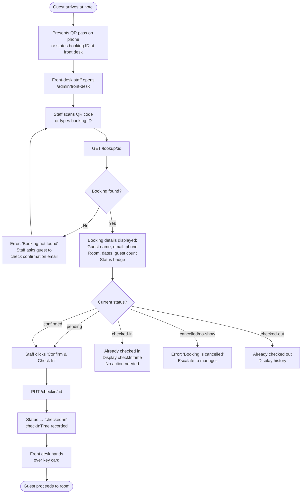

---

### 1.5 Check-Out

**Entry point:** Guest returns key card at front desk on departure day.

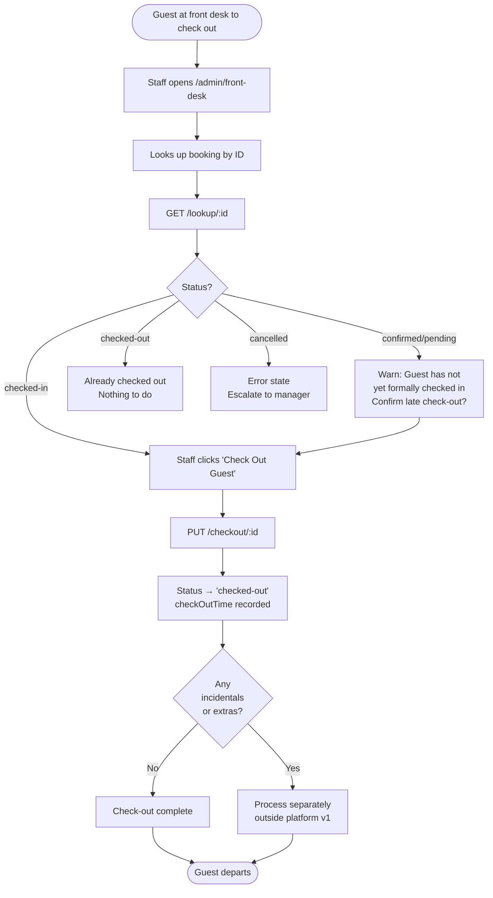

---

### 1.6 Leaving a Review

**Entry point:** Email CTA after check-out, or "My Reservations" page.

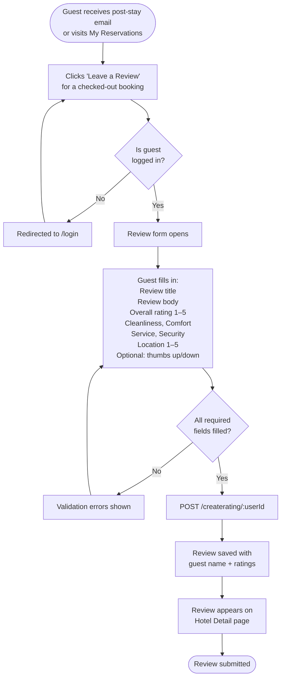

---

### 1.7 Managing Bookings (View / Cancel)

**Entry point:** User menu → "My Reservations" or `/my-reservations`.

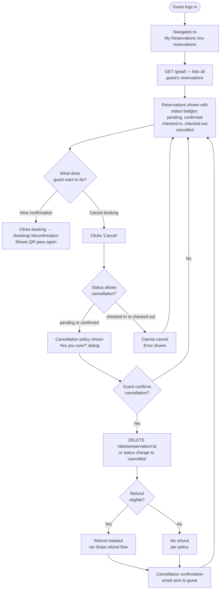

---

### 1.8 Forgot Password

**Entry point:** Login page → "Forgot password?" link.

```mermaid
flowchart TD
    A([Guest on Login page]) --> B[Clicks 'Forgot password?']
    B --> C[/forgot-password page]
    C --> D[Enters registered email address]
    D --> E[POST /forgot]
    E --> F{Email found\nin system?}
    F -- No --> G[Generic response:\n'If this email is registered\nyou will receive a link'\nNo info leakage]
    F -- Yes --> H[Signed reset token generated\nExpires in 12 minutes]
    H --> I[Token queued for\nemail delivery via QStash]
    I --> J[Guest receives email\nwith reset link]
    G --> K[Guest checks inbox]
    J --> K
    K --> L[Clicks link → /reset-password?token=...]
    L --> M{Token valid\n& not expired?}
    M -- No --> N[Error: 'Link expired or invalid'\nOffer to resend]
    N --> C
    M -- Yes --> O[New password form shown]
    O --> P[Guest enters new password\n& confirmation]
    P --> Q{Passwords\nmatch & meet\nrequirements?}
    Q -- No --> R[Validation error shown]
    R --> P
    Q -- Yes --> S[POST /reset/:token]
    S --> T[Password updated\nToken invalidated]
    T --> U[Redirected to /login\nSuccess message]
    U --> V([Guest logs in with new password])
```

---

## 2. Hotel Owner Journeys

### 2.1 Onboarding (First-Time Setup)

**Prerequisite:** Platform admin has created the Company and assigned `org_admin` role.

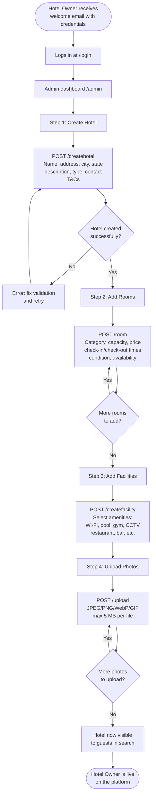

---

### 2.2 Managing Daily Reservations

**Entry point:** Admin dashboard or Manage Reservations page.

```mermaid
flowchart TD
    A([Hotel Owner logs in]) --> B[/admin/reservations]
    B --> C[GET /getall — scoped\nto their companyId only]
    C --> D[Reservation list shown\nwith status filters]
    D --> E{What action\nis needed?}

    E -- View upcoming check-ins --> F[Filter: status = 'confirmed'\nSort by dateIn ascending]
    F --> G[Review guest list\nfor today / tomorrow]

    E -- Mark no-show --> H[Find booking\nfor guest who didn't arrive]
    H --> I[Update status → 'no-show'\nPUT /updatereservation/:id]
    I --> D

    E -- Go to front desk --> J[Opens /admin/front-desk\nfor physical check-in workflow]
    J --> K([Front-Desk Journey])

    E -- View history --> L[Filter: status = 'checked-out'\nDate range picker]
    L --> M[Historical reservations shown]
    M --> D
```

---

### 2.3 Front-Desk Check-In

*(Detailed version of Guest Journey 1.4, from the Hotel Owner / staff perspective.)*

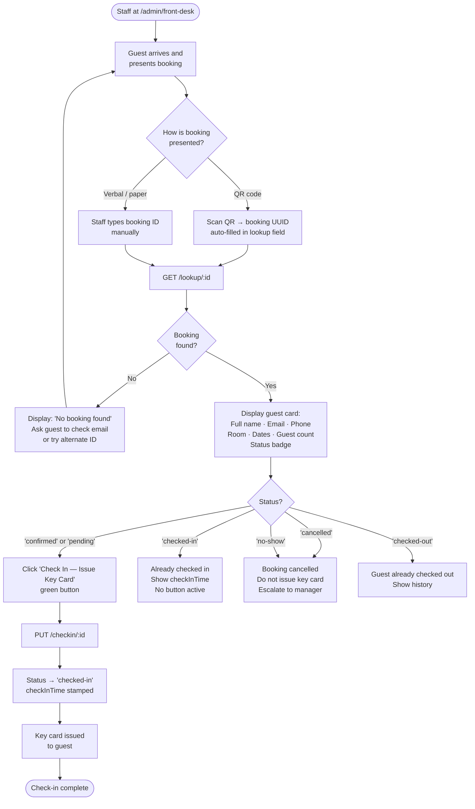

---

### 2.4 Front-Desk Check-Out

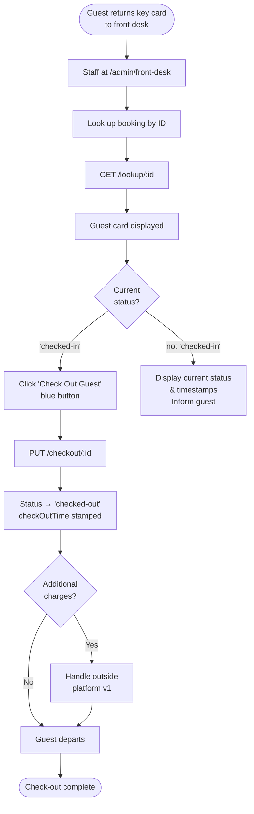

---

### 2.5 Updating Hotel & Room Information

**Entry point:** `/admin/hotels` or `/admin/rooms`.

```mermaid
flowchart TD
    A([Hotel Owner in admin dashboard]) --> B{What needs\nupdating?}

    B -- Hotel details --> C[/admin/hotels\nClick Edit on hotel]
    C --> D[Hotel edit form\npre-filled with current data]
    D --> E[Modify: name, description\ncontact info, T&Cs, type]
    E --> F[PUT /update/:id]
    F --> G{Saved?}
    G -- No --> H[Validation error\nFix and retry]
    H --> E
    G -- Yes --> I[Hotel listing updated\nglobally]

    B -- Room pricing/availability --> J[/admin/rooms\nClick Edit on room]
    J --> K[Room edit form]
    K --> L[Modify: price, deals\navailability, condition\ncategory, capacity]
    L --> M[PUT /updateroom/:id]
    M --> N{Saved?}
    N -- No --> O[Validation error]
    O --> L
    N -- Yes --> P[Room updated\nNew price visible in search]

    B -- Facilities --> Q[GET /findfacility/:hotel_id\nClick Edit]
    Q --> R[Toggle facility checkboxes]
    R --> S[PUT /facility/:id]
    S --> T[Facilities updated\nSearch filters reflect changes]

    B -- Upload new photos --> U[POST /upload\nDrag-and-drop or file picker]
    U --> V[Image stored in B2\nMediaFile record created]
    V --> W[Photos visible on\nHotel Detail page]
```

---

## 3. Platform Admin Journeys

### 3.1 Provisioning a New Hotel Owner (Tenant)

**Entry point:** A Hotel Owner has completed KYC / business verification off-platform.

```mermaid
flowchart TD
    A([Platform admin receives\napproved Hotel Owner application]) --> B[Logs in with admin credentials]
    B --> C[/admin — System Admin Dashboard]
    C --> D[Step 1: Create Company]
    D --> E[POST /companies\nName, contact email\ncontact phone, address]
    E --> F[Company record created\nwith unique companyId]
    F --> G[Step 2: Create org_admin user\nor update existing user's role]
    G --> H{User already\nhas an account?}
    H -- No --> I[POST /signup\nCreate account for Hotel Owner\nor instruct them to self-register]
    H -- Yes --> J[GET /alluser\nFind user by email]
    I --> K[PUT /updateuser/:id\nSet type = 'org_admin'\nSet companyId = new company ID]
    J --> K
    K --> L[Hotel Owner now has\norg_admin access\nScoped to their Company]
    L --> M[Send onboarding email\nto Hotel Owner\nwith login credentials & guide]
    M --> N([Hotel Owner begins\nonboarding journey])
```

---

### 3.2 Reviewing & Managing Users

**Entry point:** `/admin/users` — platform-wide user management.

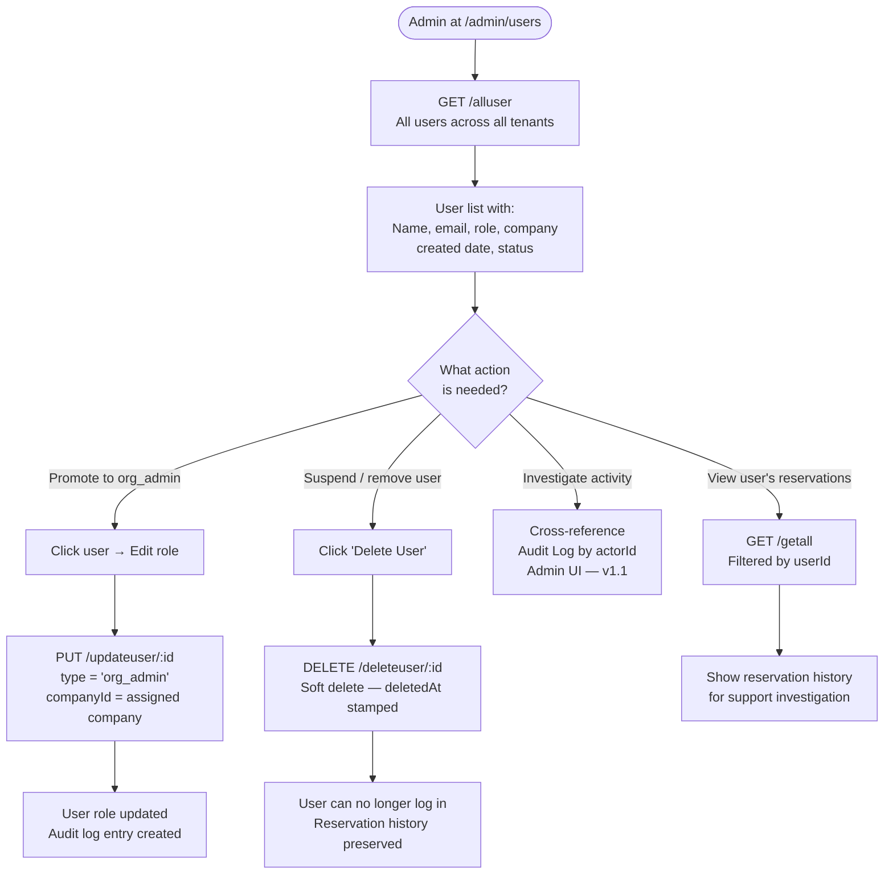

---

## 4. System Event Flows

### 4.1 Booking Confirmation Email Flow

**Triggered by:** Successful reservation creation.

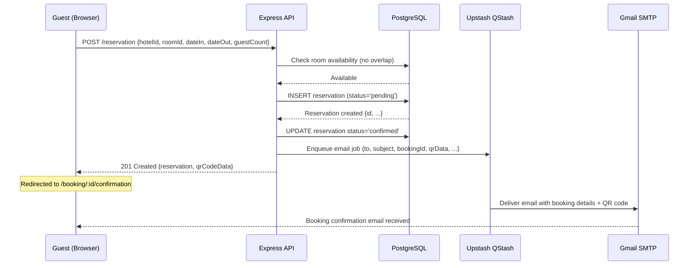

---

### 4.2 Password Reset Email Flow

**Triggered by:** User submits forgot-password request.

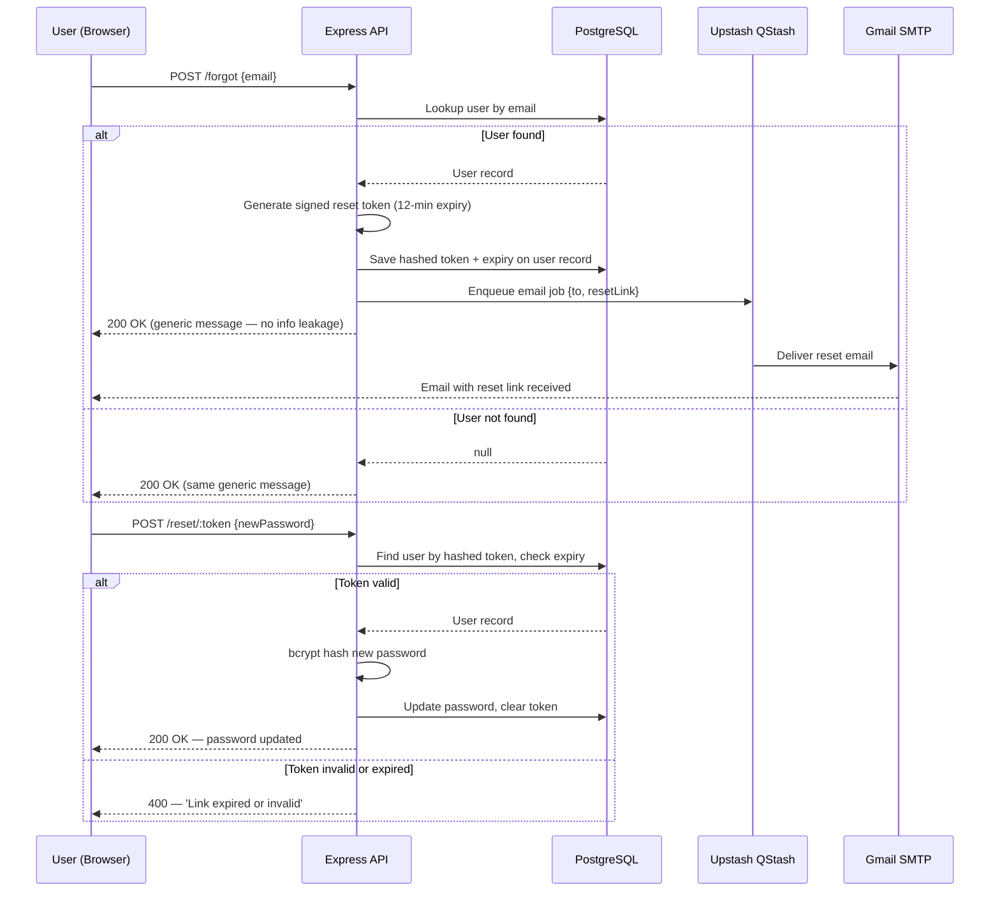

---

### 4.3 Reservation Status Lifecycle

**State machine for a single Reservation record.**

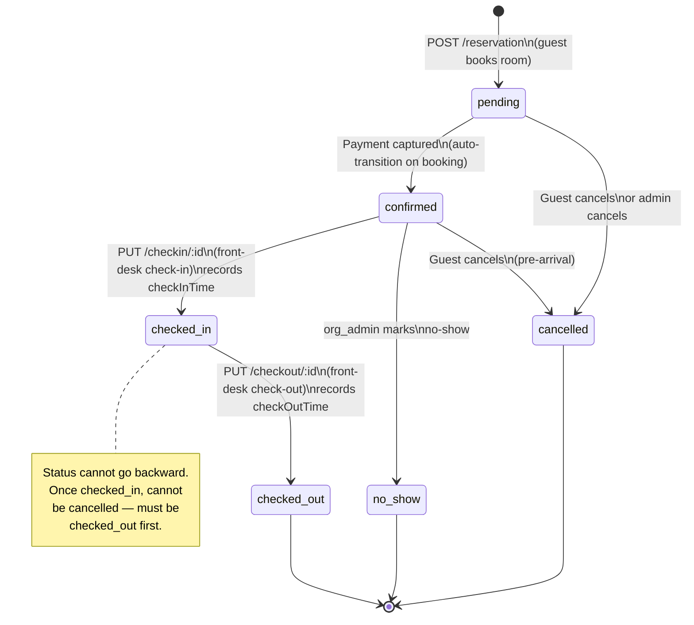

---

## Summary: Journey Touch-Points by Actor

| Journey | Actor | Key Endpoints | Pages |
|---------|-------|--------------|-------|
| Registration | Guest | `POST /signup` | `/register` |
| Login | All | `POST /login` | `/login` |
| Hotel discovery | Guest | `GET /findall`, `/topdeals`, `/bydate`, `/hotels-by-cities` | `/hotels`, `/search` |
| Booking | Guest | `POST /reservation` | `/book/:roomId`, `/booking/:id/confirmation` |
| View QR pass | Guest | `GET /getone/:id` | `/booking/:id/confirmation` |
| Check-in | Guest + Staff | `GET /lookup/:id`, `PUT /checkin/:id` | `/admin/front-desk` |
| Check-out | Guest + Staff | `PUT /checkout/:id` | `/admin/front-desk` |
| Leave review | Guest | `POST /createrating/:userId` | Hotel detail page |
| Cancel booking | Guest | `DELETE /deletereservation/:id` | `/my-reservations` |
| Forgot password | Guest | `POST /forgot`, `POST /reset/:token` | `/forgot-password`, `/reset-password` |
| Hotel onboarding | Hotel Owner | `POST /createhotel`, `/room`, `/createfacility`, `/upload` | `/admin/hotels`, `/admin/rooms` |
| Daily reservations | Hotel Owner | `GET /getall`, `PUT /updatereservation/:id` | `/admin/reservations` |
| Provision tenant | Platform Admin | `POST /companies`, `PUT /updateuser/:id` | `/admin`, `/admin/users` |
| User management | Platform Admin | `GET /alluser`, `DELETE /deleteuser/:id` | `/admin/users` |
